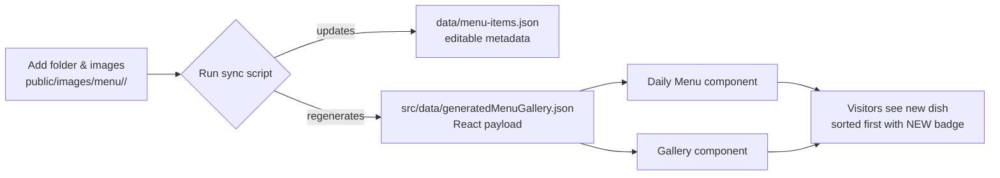

# Menu & Gallery Automation Guide

This project now auto-synchronises the Daily Menu and Gallery components with the image folders under `public/images/menu`. Follow this guide whenever you add or update dishes.

---

## Visual overview



### Folder layout snapshot

```
public/
└── images/
    └── menu/
        ├── day-starters/
        │   └── peach-cobbler-parfait/
        │       ├── hero.webp
        │       ├── plated.webp
        │       └── meta.json
        └── super-meals/
            └── peri-peri-chicken-rice-bowl/
                ├── angle-1.webp
                └── angle-2.webp
```

---

## 1. What changed?

- `scripts/sync-menu-gallery.js` inspects the menu image folders and keeps two data files in sync:
  - `data/menu-items.json` – editable metadata (name, description, price, gallery settings, timestamps)
  - `src/data/generatedMenuGallery.json` – generated payload consumed by React components
- New dishes automatically appear at the top of the Daily Menu and Gallery, showing a `NEW` badge for 14 days.

---

## 2. Adding a new dish

1. **Create the folder**
   ```
   public/images/menu/<category>/<slug>/
   ```
   The `<category>` must be one of:
   - `day-starters`
   - `super-meals`
   - `comfort-meals`
   - `add-ons`

   Use a lowercase, hyphenated `<slug>` (e.g. `peach-cobbler-parfait`).

2. **Drop in the images**
   - Add `.webp` assets (preferred). `.jpg`, `.jpeg`, `.png`, `.avif` are also accepted.
   - All files in the folder will be attached to that dish, sorted alphabetically.

3. **(Optional) Override defaults**

   Create a `meta.json` inside the folder to customise the metadata; any missing fields fall back to sensible defaults.

   ```json
   {
     "name": "Peach Cobbler Parfait",
     "description": "Layers of stone-fruit compote, vanilla custard, and house granola.",
     "price": 95,
     "showInGallery": true,
     "galleryTitle": "Peach Cobbler Parfait",
     "galleryDescription": "Dessert-for-breakfast energy with fresh peaches and crumble.",
     "galleryImage": "images/menu/day-starters/peach-cobbler-parfait/hero.webp"
   }
   ```

   Leave `showInGallery` off if you don’t want the item in the Gallery section. When omitted, new dishes default to `true`.

---

## 3. Sync the data

Run the script from the project root:

```bash
node scripts/sync-menu-gallery.js
```

The script will:
- Update or append entries in `data/menu-items.json`
- Regenerate `src/data/generatedMenuGallery.json`
- Mark new dishes with `isNew: true` (badge expires automatically after 14 days)

> Tip: commit both files together with your image assets.

---

## 4. Verify in the app

1. Start the dev server (`npm start`) and open the site.
2. Check **Daily Menu**:
   - The new dish should be at the start of its category carousel.
   - A `New` badge appears for the first 14 days.
3. Check **Gallery**:
   - If `showInGallery` is true, the card shows up under “All” and the corresponding category.
   - The badge matches the Daily Menu styling.

---

## 5. Updating existing dishes

- Update copy/price/gallery settings directly in `data/menu-items.json`, then run the sync script.
- Replacing or adding images in an existing folder automatically updates the generated payload.

---

## 6. How the badge works

- New dishes (`isNew: true`) are tagged on creation.
- The badge stays visible for 14 days, after which the script flips `isNew` to `false` during the next sync.
- No manual cleanup is required.

### UI reference

<div align="center">


<sub><strong>Daily Menu card</strong> — new dishes float to the first slot and show the “NEW” badge for 14 days.</sub>

</div>

<div align="center">


<sub><strong>Gallery card</strong> — gallery tiles inherit the badge and category styling automatically.</sub>

</div>

---

## 7. Common questions

**Can I edit `src/data/generatedMenuGallery.json` manually?**  
No. The file is regenerated each time the script runs—edit `data/menu-items.json` or folder metadata instead.

**Can I remove a dish?**  
Delete or rename its folder under `public/images/menu/...`, then run the sync script and remove the corresponding entry from `data/menu-items.json` if you want to keep the metadata tidy.

**Where do prices come from if I skip the meta file?**  
The script applies default price points per category:
- Day Starters: `80`
- Super Meals: `150`
- Comfort Meals: `130`
- Add-ons: `70`

---

Keeping these steps handy will ensure customers always see the newest dishes first while the Gallery and Daily Menu stay in sync automatically. Happy cooking ✨

